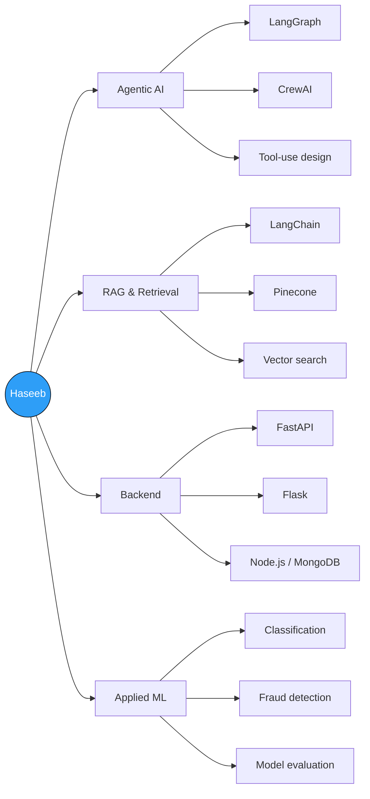
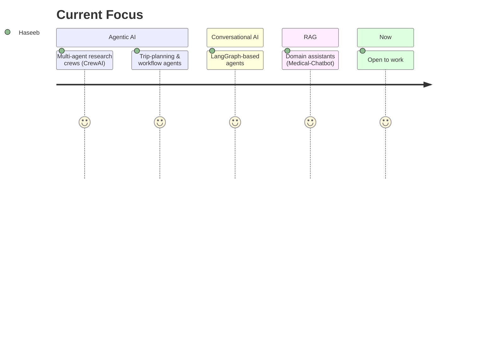

<div align="center">


[](https://mhaseebk.vercel.app/)
[](https://mhaseebk.vercel.app/)

</div>

<br/>

```python
class Haseeb:
    """Software Developer — AI & Agentic Systems"""

    def __init__(self):
        self.location  = "Karachi, Pakistan"
        self.stack     = ["Python", "LangChain", "LangGraph", "CrewAI", "FastAPI"]
        self.status    = "open_to_work"
        self.currently = "teaching LLMs to use tools without breaking things"

    def philosophy(self) -> str:
        return "a demo that works once isn't a product — build for the messy second run"

haseeb = Haseeb()
```

<br/>

## 🧠 How I Think About AI Systems



## 🛰️ Current Focus



## 🌟 Highlighted Repositories

| Repository | What it does |
|---|---|
| [**Trip-Plan-Agent**](https://github.com/mhaseebk54/Trip-Plan-Agent) | AI agent that automates end-to-end trip planning |
| [**Medical-Chatbot**](https://github.com/mhaseebk54/Medical-Chatbot) | LLM medical assistant — LangChain RAG + Pinecone + Flask |
| [**AI-Research-Assistant-with-CrewAI-**](https://github.com/mhaseebk54/AI-Research-Assistant-with-CrewAI-) | Multi-agent research crew — CrewAI + Streamlit + Groq |
| [**MarketResearch-And-ResearchAndBlog-Crew**](https://github.com/mhaseebk54/MarketResearch-And-ResearchAndBlog-Crew) | Agent crew that researches a market and drafts the blog post |
| [**Chatbots-LangGraph**](https://github.com/mhaseebk54/Chatbots-LangGraph) | Conversational agents built on LangGraph |
| [**POS-System**](https://github.com/mhaseebk54/POS-System) | Full-stack point-of-sale system — sales, inventory, transactions |

<details>
<summary>💬 <b>Ask me about...</b></summary>
<br/>

- Why your agent keeps calling the wrong tool (and how to stop it)
- RAG pipelines that don't hallucinate their sources
- The difference between a cool CrewAI demo and one that survives real users
- When *not* to reach for an agent framework at all

</details>

## 📊 GitHub Stats

<div align="center">


<sub>⚠️ These two cards are served by a shared community host that occasionally rate-limits — if either looks blank, it's their traffic, not a broken link. Refresh usually fixes it.</sub>

</div>

## 🔗 Connect

<div align="center">

[](https://mhaseebk.vercel.app/)
[](https://github.com/mhaseebk54)

</div>

---

<div align="center">
<i>"I don't just prompt LLMs — I give them tools, memory, and a reason to behave."</i>
</div>
